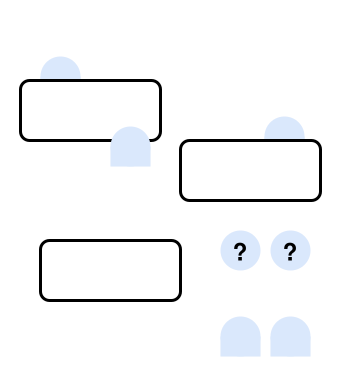

# Cat & Dog Seating

!!! note
    View the source code for this example [here](https://github.com/potassco/asplain/tree/master/examples/cat-dog).

--8<-- "examples/cat-dog/README.md:description"

<figure markdown="span">
    { width="300" }
    <figcaption>Illustration of the Cat & Dog Seating Problem</figcaption>
</figure>

## Usage

--8<-- "examples/cat-dog/README.md:usage"

## Encodings

Base Encoding:

```clingo
--8<-- "examples/cat-dog/encoding.lp"
```

Instance:

```clingo
--8<-- "examples/cat-dog/instance.lp"
```
