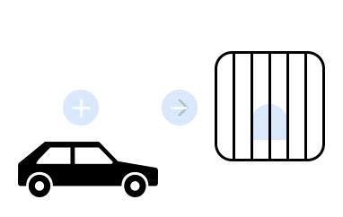

# Don't Drive Drunk

!!! note
    View the source code for this example [here](https://github.com/potassco/asplain/tree/master/examples/dont-drive-drunk).

--8<-- "examples/dont_drive_drunk/README.md:description"

<figure markdown="span">
    { width="400" }
    <figcaption>Illustration of the Don't Drive Drunk Problem</figcaption>
</figure>

## Usage

--8<-- "examples/dont_drive_drunk/README.md:usage"

## Encodings

Base Encoding:

```clingo
--8<-- "examples/dont_drive_drunk/encoding.lp"
```
