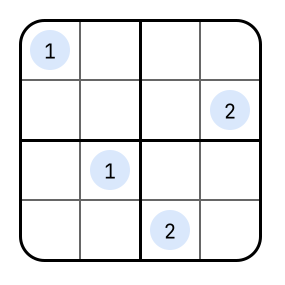

---
hide:
  - navigation
---

# Sudoku

<div class="grid" markdown>

Sudoku is a logic puzzle where the objective is to fill a `4x4` or `9x9` grid with digits so that each column, each row, and each of the nine `2x2` or `3x3` subgrids contains all of the digits from `1` to `9`.
In ASP solvers for this problem are often implemented using a generate and test approach.
Explaining queries for encodings like this can be challenging since they often lead to big explanation graphs containing many nodes.
To address this, `asplain`'s __pruning fuctionality__ can be used to reduce the size of the explanation graph and make an interpretation easier.

{ width="300", align=right }

</div>

## Usage

Basic Explanation (No Pruning):

```bash
asplain examples/sudoku/encoding.lp examples/sudoku/instance4x4.lp --query "sudoku(3,2,1)"
```

```bash
asplain examples/sudoku/encoding.lp examples/sudoku/instance9x9.lp --query "sudoku(2,2,2)"
```

Simplified Explanation (`CHANGES` + `ORPHANS` Pruning):

```bash
asplain examples/sudoku/encoding.lp examples/sudoku/instance4x4.lp --query "sudoku(3,2,1)" --prune CHANGES --prune ORPHANS
```

```bash
asplain examples/sudoku/encoding.lp examples/sudoku/instance9x9.lp --query "sudoku(2,2,2)" --prune CHANGES --prune ORPHANS
```

## Encodings

Base Encoding:

```clingo
--8<-- "examples/sudoku/encoding.lp"
```

Instance `4x4`:

```clingo
--8<-- "examples/sudoku/instance4x4.lp"
```

Instance `9x9`:

```clingo
--8<-- "examples/sudoku/instance9x9.lp"
```
