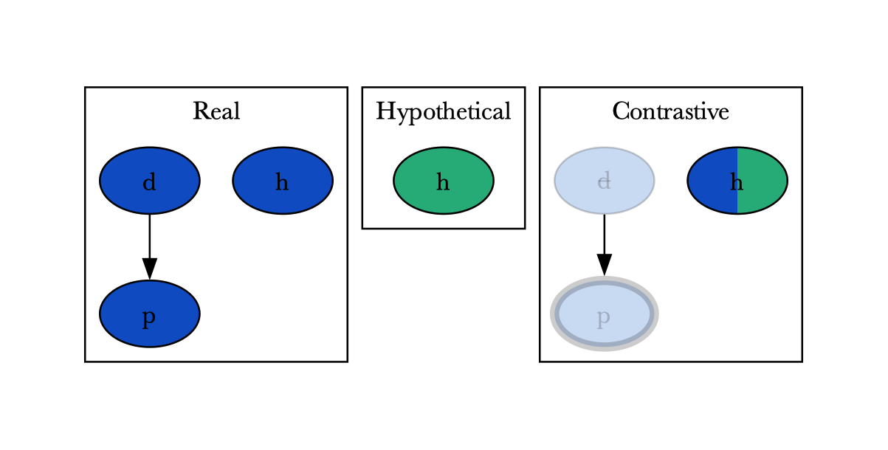

# Getting started

## Installation

=== "Pip"

    ```console
    pip install asplain
    ```

=== "Development mode"

    ```console
    git clone https://github.com/potassco/asplain.git/
    cd asplain
    pip install -e .[all]
    ```

    !!! warning

        Use only for development purposes

## Usage

### Command line interface

The command line extends the one of *clingo*.
Details about the command line usage can be found with:

```console
asplain -h
```

!!! tip

    Visit the [problem section](../reference/problem/) for details on the concepts used below.


#### Domain files

Domain files are provided normally and are the encodings and input for your problem.

#### Explanation preference

The explanation preferences are provided via command `--explanation-preferences` and are files which define:

- What can be abduced via `_abducible/2`
- What is the distance function `_distance_/3`


#### Reference model

The reference model can be provided via command line using `--model` to define a file.

!!! info

    If no model is provided, then the solving will take place and an explanation will be computed for each model found.

#### Query

The query can be provided via command line using `--query`, separated by spaces.

!!! info
    If no query is provided the user will be prompted for each model so that they input the query.


!!! example "Example: James Bond with a model"

    See the full [James Bond](../examples/james-bond) example for details on the problem and the input.


    We pass a model via the command line where `d` `h` and `p` are true. And ask a query that enforces `p` to be false.

    ```console
    asplain examples/james-bond/encoding.lp  --explanation-preference examples/james-bond/explanation-preference.lp 0 --model "d. h. p." --query "-p"
    ```

    This computes two explanation graphs.

    === "Explanation 1"
        {width="500"}
        Shows that `h` had to be removed (crossed out) for the antidote to have been provided so that James is not poisoned.

    === "Explanation 2"
        {width="500"}
        Shows that `d` had to be removed (crossed out) for James not to be poisoned
