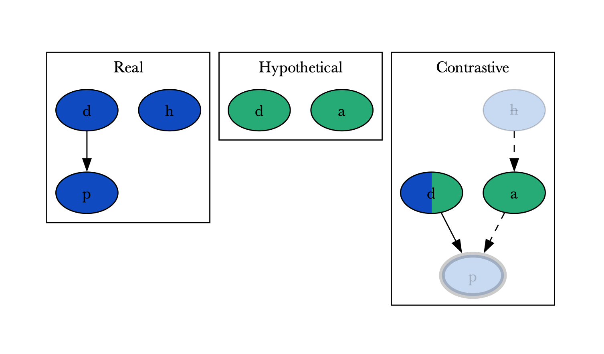

# Asplain

*Asplain* (ASP+explain) is a system to generate and work with explanation graphs using ASP.


## Example

If James Bond drinks drug d, he will have paralysis p unless has been administered an antidote a.
The MI5 daily administers Bond antidote a, unless he is on holiday h.
Suppose now that, that day, Bond was actually on a holiday with Vesper.

=== "How could James have been poisoned?"

    {width="500" align=left}
    ```prolog title="encoding.lp"
    p :- d, not a. %(1)!

    a :- not h. %(2)!

    d. %(3)!
    h.
    ```

    1.  :speech_balloon: Posioned if drinks d and not antidote a. a acts as an inhibitor of p.
    2.  :speech_balloon: Antidote if not holiday h inhibitor of a, enabler of p.
    3.  :speech_balloon: Bond drinks d and is not on a holiday.


!!! info

    *asplain* is part of the [Potassco] suit (which is the home of *clingo* and the other ASP tools)

[Potassco]: https://potassco.org/
