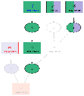

# Explanation Graph

The contrastive explanation graph is asplain's central representation of an explanation.
It contrasts the reference program and its model with the found foil, making the differences between both worlds explicit.
Since the graph is directed, edges can express the cause-effect relationships of the program, which makes the explanation easy to follow.
This page describes how the graph is constructed, how it is represented as facts, and how to read its visualization.

## Program Graph

The basis of every explanation is the program graph, a directed graph that fully encodes a ground logic program.
It contains a node for every atom and every rule of the program:

- __Atom nodes__ represent the atoms of the program.
- __Rule nodes__ represent the rules and are typed as either `choice` or `disjunction` rules. Facts and integrity constraints are special cases of disjunctive rules.

The edges connect rules with the atoms they depend on and derive:

- An edge from an atom to a rule means the atom appears in the rule's body. The edge is __positive__ for positive body literals and __negative__ for negative ones (`not a`).
- An edge from a rule to an atom means the atom appears in the rule's head.

As a consequence, facts appear as rule nodes without incoming edges, while integrity constraints appear as rule nodes without outgoing edges.

The program graph is constructed from [clingo's reified representation](https://potassco.org/clingo/) of the grounded program using the [`reify-to-pg.lp` encoding](../encodings/index.md).

## Contrastive Explanation Graph

To turn the program graph into a contrastive explanation, it is annotated with membership information that captures the differences between the reference and the foil world:

- __Program membership__ assigns each rule node the programs it occurs in: the reference program, the foil program, or both. Rules only in the foil were _added_ during foil finding, rules only in the reference were _removed_.
- __Model membership__ assigns each atom node the models it holds in: the reference model, the foil model, or both. It is extended to rule nodes, indicating whether the body of a rule is satisfied by the respective model.

### Fired Constraints

The body of an integrity constraint can never be satisfied by a single model, so its model membership is always empty.
Nevertheless, constraints often encode the relevant domain knowledge behind an explanation.
To capture their impact, asplain marks a constraint as __fired__ if its body would be satisfied when the reference and foil models are considered simultaneously.
Informally, these are the constraints that would have been violated under specific changes to the reference program, and they frequently are the reason why a change was necessary in the first place.

## Fact Representation

asplain represents the contrastive explanation graph as a set of facts, which serve as the interface for [pruning](../pruning/index.md), visualization, and the LLM-based natural language explanations.
The following predicates are used:

| Predicate | Meaning |
| --------- | ------- |
| `node(N, T)` | `N` is a node of type `T`, where `T` is `atom`, `rule(choice)`, or `rule(disjunction)` |
| <nobr>`edge((X,Y), S)`</nobr> | Directed edge from `X` to `Y` with sign `S`, where `1` is positive and `0` is negative |
| `program(R, W)` | Rule `R` is part of the program of world `W`, where `W` is `ref` or `foil` |
| `model(N, W)` | Node `N` is satisfied by the model of world `W` |
| `query(A, V)` | Atom `A` is part of the query with truth value `V` (`1` for positive, `0` for negative) |
| `optional(C, R)` | Rule `R` is a change candidate, where `C` is `add` or `remove` |
| `fired(R)` | Integrity constraint `R` is fired |

_Example_:

For the [James Bond example](../../examples/jamesbond.md) with the query `p` ("Why is Bond not poisoned?"), asplain finds a foil in which the fact `c` (Bond is careful) is removed and the addable fact `t` (contact with toxin) is added.
The resulting contrastive explanation graph is represented by the following facts:

```clingo
query(p,1).
optional(add,7).   optional(remove,6).   optional(remove,5).

node(1          , rule(choice)).
node(2..7       , rule(disjunction)).
node((a;p;c;t;d), atom).

edge((1,d),1).
edge((p,2),1).  edge((c,2),1).
edge((3,p),1).  edge((t,3),1).
edge((4,p),1).  edge((d,4),1).  edge((a,4),0).
edge((5,a),1).  edge((6,c),1).  edge((7,t),1).

program(1..5, ref).     program(6, ref).
program(1..5, foil).    program(7, foil).

model((c;a)  , ref).   model((1;6;5)  , ref).
model((t;c;p), foil).  model((1;3;6;7), foil).

fired(2).
```

<figure markdown="span">
    { width="300" }
    <figcaption>Resulting Explanation Graph from the example facts above</figcaption>
</figure>

## Visualization

asplain visualizes contrastive explanation graphs using [clingraph](https://potassco.org/clingraph/), either directly from the command line or interactively in the [user interface](../cli/index.md).
The membership information is conveyed through color and style highlighting:

| Element | Meaning |
| ------- | ------- |
| Rectangle node | Rule (labeled `choice` or `disjunction`) |
| Ellipse node | Atom |
| Solid edge | Positive body literal or rule-head relationship |
| Dashed edge | Negative body literal |
| Purple fill | Satisfied by the __reference__ model |
| Green fill | Satisfied by the __foil__ model |
| Purple-green fill | Satisfied by __both__ models |
| White fill | Satisfied by neither model |
| Red fill | __Fired__ integrity constraint |
| Blue border | Rule __added__ in the foil |
| Red border | Rule __removed__ in the foil |

Hovering over a node in the interactive interface shows a tooltip with the underlying rule and its [`@label` tag](../tagging/index.md) if one was provided.

With this highlighting, the example graph above can be read as:
_James would be poisoned if he hadn't been careful and had been in contact with a toxin._

## Reducing the Graph Size

For complex problems the explanation graph can grow to a size where interpretation becomes difficult.
asplain offers two mechanisms to keep the graph focused:

- [__Pruning__](../pruning/index.md) removes parts of the graph as a post-processing step, e.g., orphan subgraphs or all nodes not lying on a path between the query and the changed rules.
- The [`@hide` tag](../tagging/index.md) excludes specific rules from the final graph, e.g., auxiliary rules that are irrelevant to the explanation.
