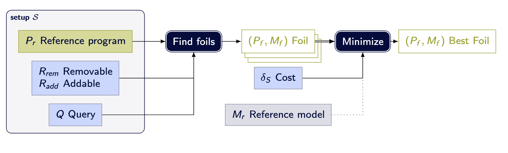

# Reference

This section contains detailed documentation and technical information about
the system. It’s designed for those who want to explore the inner workings,
learn about specific components, or access essential resources.

The basic workflow of *asplain* is depicted in the following diagram:

## Setup $S$

Provides all the information needed to find the explanations (foils).
It is composed of:

- The reference program $P_r$
- The set of removable and addable rules $R_{rem}$ and $R_{add}$
- The query $Q$

In the implementation the setup is generated using the reification of a [tagged program](./tagging.md).
For details on the generation and representation of the setup see the [setup construction](./setup.md).

## Foil finding

Foil finding is the step where *asplain* builds an alternative version of the program that matches the user's expectation.
A foil is composed by a modified version of the reference program and an answer set of that modified program that satisfies the query $Q$.

In simple terms, *asplain* answers a question such as _"Why not `p`?"_ by looking for a small, controlled change to the reference program that makes `p` true.
That changed program, together with one of its answer sets, is called a **foil**.

A foil program $P_{f}$ and a foil model $M_{f}$ is a valid foil if it satisfies the following two conditions:

- **$P_{f}$ modifies the reference program**

    $P_{r} \setminus R_{rem} \subseteq P_{f} \subseteq (P_{r} \cup R_{add})$

- **$M_{f}$ satisfies the query**

    $M_{f} \in AS(P_{f})\ \land\ M_{f} \models Q$

For details on the foil finding process see the [finding explanations](./foils.md) section.

### Foil selection

The preferred foil is selected based on the user preferences using optimization. Here is where a reference model $M_r$ might be provided to guide the selection of the most relevant foil.

For details on the foil selection process see the [explanation selection](./preferences/index.md) section

## Unsatisfiable programs

Foil finding also works when the reference program has no answer set.
In that case, the goal may simply be to recover satisfiability.

If the query is empty, *asplain* looks for an allowed modification that makes the program satisfiable again.
Any answer set of that repaired program can then be used as the foil model.

## Contrastive explanation

The contrastive explanation lets you visualize the difference between the reference and foil.

For more information on the contrastive explanation see the [contrastive explanation graph](./explanation-graph.md) section.
