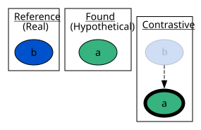

# Basic

This is the most basic example where for `a` to be true, `b` would have to be
removed

## Command line

```console
asplain examples/basic/encoding.lp  --explanation-preference examples/basic/explanation-preference.lp 0  --query "a" --model examples/basic/model.lp
```


