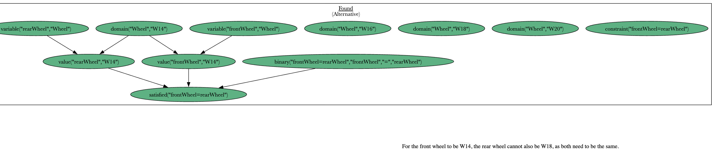
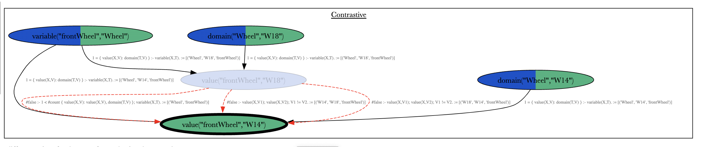
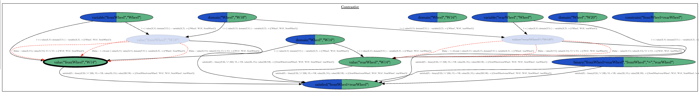

# Configuration problem

The most basic configuration example for a bike.

## Use

### Without setting a model

```bash
asplain examples/config/encoding.lp examples/config/instance.lp --explanation-preference examples/config/explanation-preference.lp --log info --llm --query "value(\"frontWheel\",\"W14\")"
```

The alternative model is not nice, since it speaks of W18 even if it is not
set.



### Fixing a model

#### Case 1

This is ok when the rear wheel is the one set.

```bash
asplain examples/config/encoding.lp examples/config/instance.lp examples/config/fixed-model-rear.lp --explanation-preference examples/config/explanation-preference.lp --log info --llm --query "value(\"frontWheel\",\"W14\")" --prune
```

*"For the front wheel to be the same as the rear wheel, it must be set to W14
instead of W18, since both wheels cannot have different values
simultaneously."*

We just get two explanations since in one the value of rearWheel comes from a
fact and in the other it comes from the choice.

#### Case 1

This is not so nice if it is the front wheel that is set. It talks about the
rear wheel anyway, when it should not.

```bash
asplain examples/config/encoding.lp examples/config/instance.lp examples/config/fixed-model-front.lp --explanation-preference examples/config/explanation-preference.lp --log info --llm --query "value(\"frontWheel\",\"W14\")" --prune
```

**Model from fact** "For the front wheel to be set to W18, it needs to stop
being W14, since both the front wheel and rear wheel must be the same and
currently, the rear wheel is set to W14."\*

**Model from choice** *"For the front wheel to be W14, the rear wheel would
need to be W14 as well, but it is currently W18"*

Here it should just say the first sentence.

### Different preference

We can use a different preference which only allows to change the constraints.
This could be useful for an engineer who is debugging the program with known
valid values.

```bash
asplain examples/config/encoding.lp examples/config/instance.lp examples/config/fixed-model-rear.lp --explanation-preference examples/config/explanation-preference-constraint.lp --log info --llm --query "value(\"frontWheel\",\"W14\")" --prune
```

*"To have the front wheel set to W14, it would need to be removed that both
wheels are equal, since they are both currently set to W18."*

*"For the front wheel to be 'W14', it would require that the rear wheel is also
'W14', but that can't happen since the rear wheel is already 'W18'."*

*"If the front wheel is to be W14, then it would need to be the same as the
rear wheel, which is set to W18. Therefore, to have a front wheel of W14, the
assumption of them being equal must be removed"*

### Assumption based

We can input the model using assumptions, this can be done by just changing the
preference encoding. We then use a distance that favors assumptions before
abducing something else.

```bash
asplain examples/config/encoding.lp examples/config/instance.lp --explanation-preference examples/config/explanation-preference-assumption.lp --explanation-preference examples/config/fixed-input-rear.lp  --log info --llm --query "value(\"frontWheel\",\"W14\")"
```

User input stays hidden from the graph as it is passed directly in the
preference. Notice then, that the model is not provided as part of the first
files that are reified but as part of the preference which uses the meta
predicates.

This also gives us a single explanation instead of two, since there is no fact
so it is the choice that has to be used to get the fact. Overall this seams
like a nicer approach in that regard.

*Still handling the light blue nodes wrong*

If we assume frontWheel instead of rear Wheel it is still uses the fact that
front and rear need to be the same:

```bash
asplain examples/config/encoding.lp examples/config/instance.lp --explanation-preference examples/config/explanation-preference-assumption.lp --explanation-preference examples/config/fixed-input-front.lp  --log info --llm --query "value(\"frontWheel\",\"W14\")"
```

*"For the front wheel to be W14, the rear wheel has to be W14 as well, but
since the rear wheel is actually W18, the front wheel cannot be W14."*

But we just want to use the constraint that it can't have two values.

But if we use the pruned graph:

```bash
asplain examples/config/encoding.lp examples/config/instance.lp --explanation-preference examples/config/explanation-preference-assumption.lp --explanation-preference examples/config/fixed-input-front.lp  --log info --llm --query "value(\"frontWheel\",\"W14\")" --prune
```

we get the expected thing:

*"To have the front wheel be "W14", the option "W18" must be removed, since a
wheel cannot have two different values at the same time."*

but if we prune with the rear wheel, it gets rid of the node that is abducted

```bash
asplain examples/config/encoding.lp examples/config/instance.lp --explanation-preference examples/config/explanation-preference-assumption.lp --explanation-preference examples/config/fixed-input-rear.lp  --log info --llm --query "value(\"frontWheel\",\"W14\")" --prune
```



**Wrong!**

*"To have the front wheel be "W14", the option "W18" must be removed, since a
wheel cannot have two different values at the same time."*



*"For the front and rear wheels to be equal, it is necessary to change the rear
wheel to W18, as having the front wheel as W14 and the rear as W18 violates
this equality condition."*

## TODOS

- Fix prompt to interpret the light blue nodes properly.
- Fix prune so that it includes missing nodes
