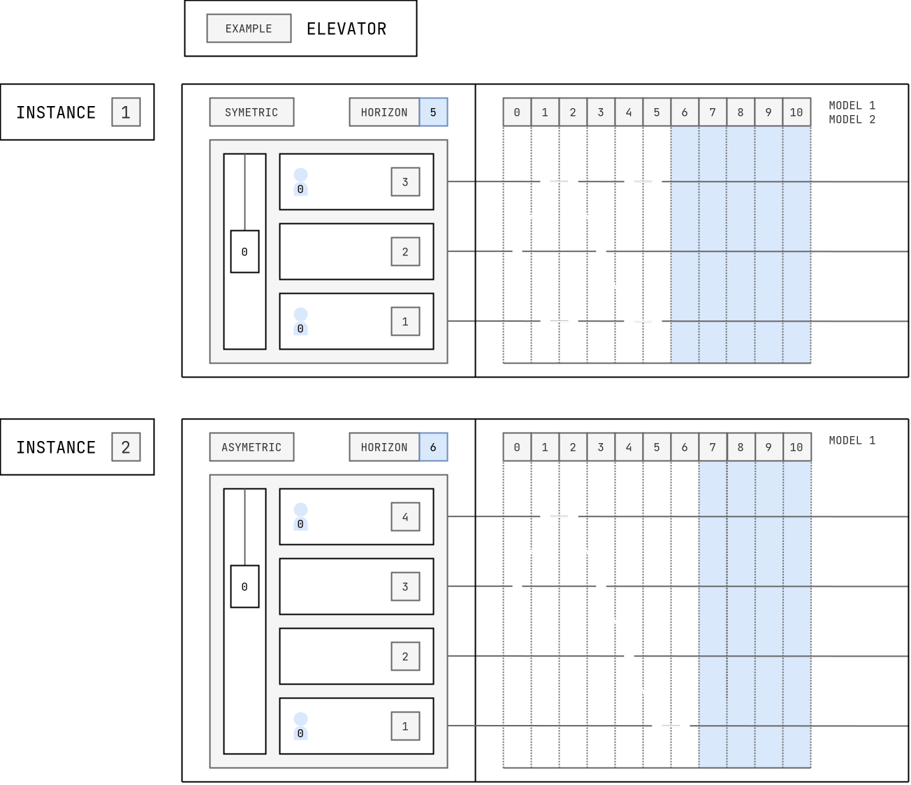

# Elevator

This is an example of a temporal encoding modeling elevator movements between different floors

> [!WARNING]
> This example is under current development and not ready to be tested with yet

```bash
asplain examples/elevator/encoding_standard.lp examples/elevator/instance.lp --explanation-preference examples/elevator/explanation_preference.lp --model examples/elevator/model.lp
```

