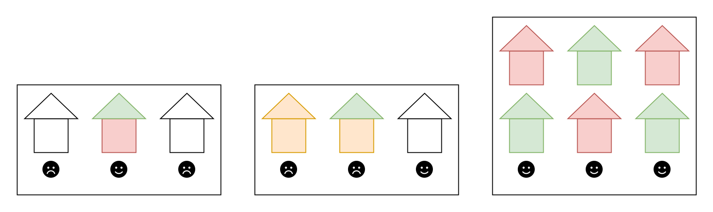
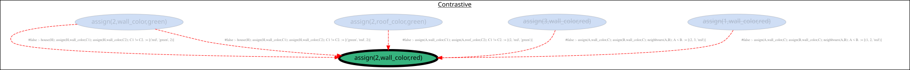

# Neighbours Problem

It can be hard to get along with your neighbours.

## Problem

The goal of this encoding is to find wall and roof colors for three neighbouring houses.
The conditions for finding these colors are:

+ each house has to have the same color on it's roof as are it's walls
+ two neighbouring houses can't have the same wall colors



## Usage

```bash
asplain examples/neighbours/encoding.lp --explanation-preference examples/neighbours/explanation-preference.lp --explanation-preference examples/neighbours/input.lp --log=info --query 'assign(2,wall_color,red)' --prune
```

Input Facts (abducible) :
```
_input(add, assign(1,wall_color,red)).
_input(add, assign(3,wall_color,red)).
```

Query :

```
assign(2,wall_color,red)
```

Graph :


